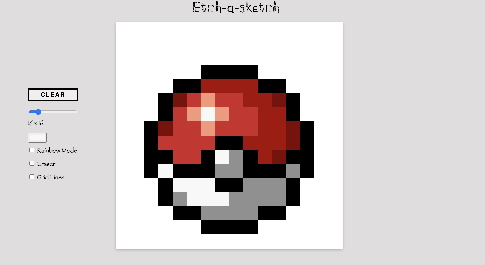

# Etch-a-Sketch 
Project for TOP (The Odin Project)

## How to Use 
Click Link to Access Github Pages Live Preview: https://shargrove09.github.io/etch-a-sketch/
Hold and drag mouse (left-click) to draw on canvas. 

## Functionality includes: 
- Color Selector 
- Adjustable Grid Size 
- Random Color Mode (Rainbow) 
- Eraser 
- Clear Grid 
- Show/Hide Grid Lines

### Example Sketch

